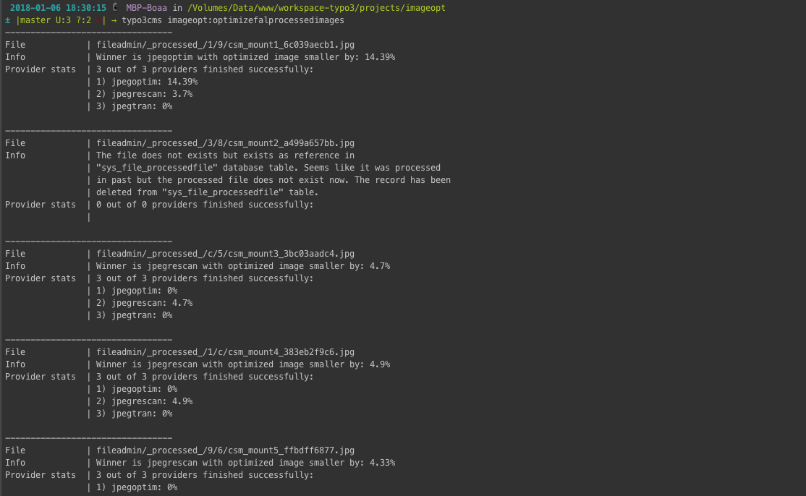
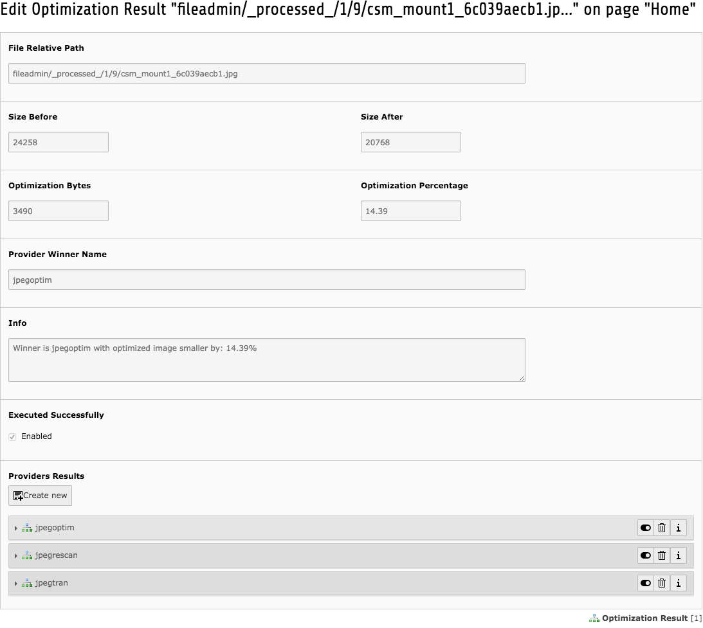
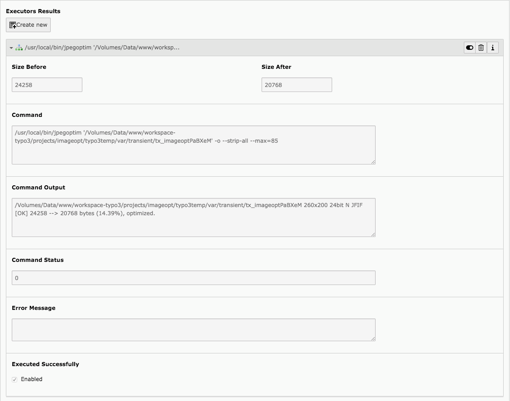

TYPO3 Extension imageopt
========================

    .. image:: https://styleci.io/repos/80069905/shield?branch=master
       :target: https://styleci.io/repos/80069905

    .. image:: https://scrutinizer-ci.com/g/sourcebroker/imageopt/badges/quality-score.png?b=master
       :target: https://scrutinizer-ci.com/g/sourcebroker/imageopt/?branch=master

    .. image:: https://travis-ci.org/sourcebroker/imageopt.svg?branch=master
       :target: https://travis-ci.org/sourcebroker/imageopt

    .. image:: https://poser.pugx.org/sourcebroker/imageopt/license
       :target: https://packagist.org/packages/sourcebroker/imageopt

.. contents:: :local:

What does it do?
----------------

This extension optimize images resized by TYPO3 so they will take less space,
page will be downloaded faster and Google PageSpeed Insights score will get higher.

Example CLI output:

TYPO3 backend - "Optimization Result" record example:

TYPO3 backend - "Executor Result" record example:

Features
--------

- If you enable more than one image type optimization provider then all of them will be executed and the best optimized
  image is choosen as result. All other results are stored in database so you can build results statistics later.

- Own providers can be registered with page TSconfig.

- Providers can have more than one executor and executors can be chained. So for example you create provider that
  consist of two chained executors: first executor will optimize png (loosy) and the second executor will optimize
  image with loosless technicques. (its real case for pngquant + pngcrush)

- Its safe as the original images, for example in folder ``fileadmin/``, ``uploads/`` are not optmized!
  Only already resized images are optmized, so for FAL that would be files form ``_processed_/`` folders and for
  ``uploads/`` it will be files from ``typo3temp/assets/images``. Imageopt can force images to be processed so
  in other words you will not find any image in HTML that links directly to original images in ``/fileadmin/``
  or ``/uploads/``.

- Support for following linux binaries.
  For png: mozjpeg, optipng, pngcrush, pngquant. For gif: gifsicle. For jpeg: jpegoptim, jpegrescan, jpegtran.

- Support for following remote optimisation providers: imageoptim.com, kraken.io, tinypng.com.

Installation
------------

1) Install using composer:

   ::

    composer require sourcebroker/imageopt

Configuration
-------------

1) Open main Template record and add "imageopt" in tab "Includes" -> field "Include static (from extensions)"

2) Enable provides you need.

   a) If you accept lossy optimisations then good start is:

      For local binaries:
      - for jpeg: mozjpeg
      - for gif: gifsicle
      - for png: pngquant (with pngcrush)

      For remote providers:
      - for jpeg: kraken.io, tinypng.com, imageoptim.com
      - for gif: kraken.io, imageoptim.com
      - for png: kraken.io, tinypng.com, imageoptim.com

      Now the question is if you want more providers to optimize image and choose the best optimisation of you trust
      one provider and want to have results from this one provider always.

      If you want only one privider and you accept paying for example for kraken.io then the config for you is:

      ::

        tx_imageopt {
          providers {
            kraken {
                enabled = 1
                executors.10.api.auth.key = your_kraken_key
                executors.10.api.auth.pass = your_kraken_pass
            }
          }
        }

      If you want that more provides will optimize image and the best optimisation will be used as result then
      you can enable more than one provider like in following example:

      ::

        tx_imageopt {
          providers {
            // remote
            kraken {
                enabled = 1
                executors.10.api.auth.key = your_kraken_key
                executors.10.api.auth.pass = your_kraken_pass
            }
            tinypng {
                enabled = 1
                executors.10.api.auth.key = your_tinypng_key
            }
            imageptim {
                enabled = 1
                executors.10.api.auth.key = your_imageptim_key
            }

            // binaries
            gifsicle.enabled = 1
            mozjpeg.enabled = 1
            pngquant-pngcrush.enabled = 1
            }
          }
        }

   b) If you accept only lossless optimisations then good start is:

      - jpeg: jpegtran, jpegtran-mozjpeg (jpegrescan is wrap around jpegtran-mozjpeg)
      - gif: gifsicle
      - png: pngcrush, optipng

      So the Page TSConfig you should add that will enable providers is:

      ::

        tx_imageopt {
          optimize >
          optimize {
              10 {
                  fileRegexp = .*
                  providerType = lossless
              }
          }
          providers {
            // remote
            kraken.enabled = 1
            tinypng.enabled = 1
            imageptim.enabled = 1

            // binaries
            gifsicle.enabled = 1
            jpegtran.enabled = 1
            jpegtran-mozjpeg.enabled = 1
            optipng.enabled = 1
            pngcrush.enabled = 1
          }
        }

3) Disable not needed providers.

   a) If you accept lossy optimisations then good start is:

      - for jpeg: mozjpeg (best results), jpgoptim
      - for git: gifsicle
      - for png: pngquant

      So the Page TSConfig you should add that will enable providers is:

      ::

        tx_imageopt {
          providers {
            gif {
              gifsicle.enabled = 1
            }
            jpeg {
              jpegoptim.enabled = 1
              mozjpeg.enabled = 1
            }
            png {
              pngquant.enabled = 1
              pngquant-pngcrush.enabled = 1
            }
          }
        }

   b) If you accept only lossless optimisations then good start is:

      - jpeg: jpegtran, jpegtran-mozjpeg (jpegrescan is wrap around jpegtran-mozjpeg)
      - git: gifsicle
      - png: pngcrush, optipng

      So the Page TSConfig you should add that will enable providers is:

      ::

        tx_imageopt {
          providers {
            gif {
              gifsicle.enabled = 1
            }
            jpeg {
              jpegtran.enabled = 1
              jpegtran-mozjpeg.enabled = 1
            }
            png {
              optipng.enabled = 1
              pngcrush.enabled = 1
            }
          }
        }

Usage
-----

1) Make a direct cli command run to optimize all existing images at once for first time.

   a) For FAL processed images:
      ::

        php typo3/sysext/core/bin/typo3 imageopt:optimizefalprocessedimages --numberOfImagesToProcess=999

   b) For folder processed images.
      ::

        php typo3/sysext/core/bin/typo3 imageopt:optimizefolderimages --numberOfImagesToProcess=999

      Command "imageopt:optimizefolderimages" will optimize images in following folders:

      - typo3temp/pics/
      - typo3temp/GB/
      - typo3temp/assets/images/

2) For all images which will be processed in future set up scheduler job. For TYPO3 9.5 use
   "Execute console commands" task.

Configuration for frontend image processing
-------------------------------------------

As already stated imageopt extension offers processing of all images even if the processing is not needed (for example because the size of original image is the same as desired image). Its good and safe because original images in folder ``fileadmin/``, ``uploads/`` are not optmized so in case of wrong optimisation nothing will be destroyed! Only already resized images are optmized, so for FAL that would be files form ``_processed_/`` folders and for ``uploads/`` it will be ``typo3temp/assets/images``.

To enable this feature you need to open main Template record and add "imageopt" in tab "Includes" -> "Include static (from extensions)". If you do not enable this feature then it can be that not all images will be optimized as part of them will be used directly from ``fileadmin/`` or ``uploads/`` folders.

The Typoscript added by imageopt is:

::

  plugin.tx_imageopt {
     imageProcessing {
        // Force processing of all images on frontend because imageopt should not optimize original images.
        force = 1
        exclusion {
          // Regexp on filepath and filename. When true this file will not be forced to be processed on frontend.
          // Example /animation.*\.gif/ -> do not force gif files that have animation in name or folder name.
          // Example /\.gif/ -> do not force gif files
          regexp =
        }
     }
  }

As you see you can use ``plugin.tx_imageopt.exclusion.regexp`` to exclude files which will be not forced to be processed (so the original version will be used). This is handy for example for gif animations (which are not supported to be processed by TYPO3). You can use ``plugin.tx_imageopt.exclusion.regexp`` also to not process images that you think are arleady optimized enough.

Configuration for images optimisation
-------------------------------------

Check https://github.com/sourcebroker/imageopt/blob/master/Configuration/TsConfig/Page/tx_imageopt.tsconfig for
avaliable configuration options.

Technical notes
---------------

* For FAL only files that are in "sys_file_processedfile" are optimized. Table "sys_file_processedfile"
  has been extended with field "tx_imageopt_executed_successfully". If file has been optimised then the field
  "tx_imageopt_executed_successfully" is set to 1.

  You can reset the "tx_imageopt_executed_successfully" flag with command:
  ::

    php typo3/sysext/core/bin/typo3 imageopt:resetoptimizationflagforfal

  This can be handy for testing purposes.

* If you optimize files from folders then if file has been optimized it gets "executed" persmission bit. So for most
  cases its 644 on the beginning and 744 after optimization. The "execution" bit is the way script knows which files
  has been optimized and which one still needs.

  You can reset the "executed" bit for folders declared in "tx_imageopt.directories" with command:
  ::

    php typo3/sysext/core/bin/typo3 imageopt:resetoptimizationflagforfolders

  This can be handy for testing purposes.

* There is table "tx_imageopt_domain_model_optimizationresult" with relation to two more tables
  "tx_imageopt_domain_model_providerresult" and "tx_imageopt_domain_model_executorresult".
  They hold statistics from images optimizations. You can check there what command exactly was
  used to optimize image, what was the result, error, how many bytes image has before and after
  for each executor and for each provider.

Changelog
---------

See https://github.com/sourcebroker/imageopt/blob/master/CHANGELOG.rst
